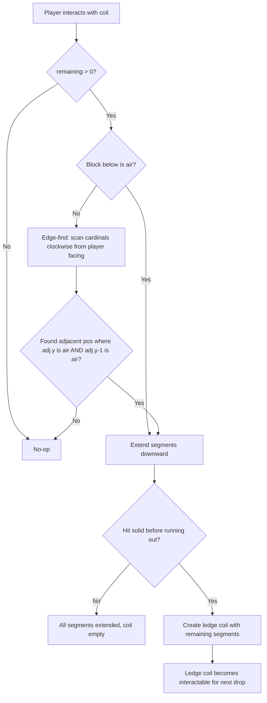
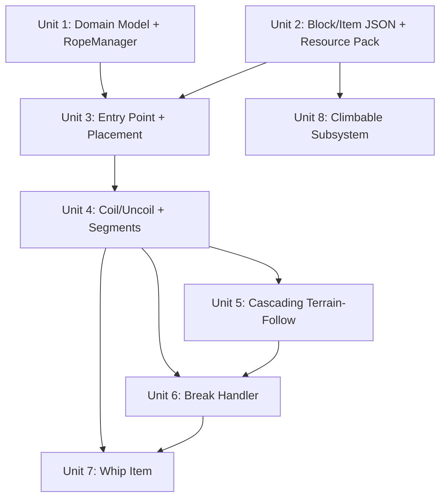

# feat: Add Ropes, Rope Ladders, and Whips

## Overview

Add three new items to the mod — Rope Ladders, Ropes, and Whips — that share an anchor-and-cascade topology similar to the existing hinge/panel system but serve vertical traversal and utility roles. Rope Ladders are wall-mounted climbable infrastructure with simple coil/uncoil. Ropes anchor to any face and cascade down terrain via ledge coils. Whips are dual-purpose items (weapon + rope deployer) for tactical climbing.

All new blocks and items use the `ropes:` namespace for eventual spinout into a standalone add-on while living inside the existing `bigdoors_bp/` and `bigdoors_rp/` packs for now.

## Problem Frame

Players need vertical traversal options beyond vanilla ladders, which require backing blocks at every level and offer no ranged deployment. The three items address distinct gameplay roles: Rope Ladders for tactical infrastructure (castle defenders can coil/uncoil), Ropes for terrain-following exploration (cascading down cliff faces), and Whips for quick-deploy tactical access (see origin: `docs/brainstorms/2026-05-17-ropes-and-whips-requirements.md`).

## Requirements Trace

- R1. `ropes:` namespace prefix on all new blocks/items
- R2. Code in `scripts/ropes/` sharing bigdoors manifest and entry point
- R3. Rope Ladder: wall-face-only placement, anchor + column segments
- R4. Rope Ladder: collision box, climbable (ladder behavior)
- R5. Rope Ladder: simple coil/uncoil, single column only, no cascading
- R6. Rope: any-face placement (top, bottom, side)
- R7. Rope: no collision (pass-through)
- R8. Rope: climbable like vines (Space up, Shift down)
- R9. Segment count tracked per coil (anchor or ledge coil)
- R10. Coiled state: single block with coiled texture
- R11. Uncoil: extend downward, edge-finding when floor below is solid
- R12. Recoil: retract all segments, preserve count
- R13. Cascading: excess segments pool as ledge coil (Rope only)
- R14. Ledge coil extension: interact to extend further downward
- R15. Retract from above: one segment at a time from bottommost drop
- R16. Full recoil: interact with anchor recoils entire cascade
- R17. Add segments: use item on coil, or place at bottom of extended chain
- R18. Break: segments below break drop as items; above remain intact
- R19. Whip: main-hand item, dual weapon/tool
- R20. Whip weapon: vanilla-range melee with weak damage via `minecraft:damage` component (extended-range attack deferred — see Scope Boundaries)
- R21. Whip tool: right-click deploys 1-4 rope segments from target face
- R22. Whip handle: bottom segment shows distinct texture
- R23. Whip rope: climbable
- R24. Whip break: entire chain removed, no item drops
- R25. Whip return: to deployer inventory, fallback to item entity
- R26. Whip rope: no coil/uncoil, temporary deployment only

## Scope Boundaries

- No horizontal ropes (vertical-only)
- No rope physics or swinging
- No rope bridges
- No Whip enchantments
- No Java parity (deferred, tracked in `docs/parity-checklist.md`)
- No physical pack separation (deferred to spinout)
- No Rope Ladder cascading
- No extended-range whip melee (R20 v1 is vanilla-range only; extended range requires `entityHitEntity` + distance verification — deferred to follow-up)
- Crafting recipes deferred (creative-only for initial implementation)

## Context & Research

### Relevant Code and Patterns

- **Hinge/Panel anchor-child topology** (`scripts/DoorManager.js`, `scripts/domain/DoorAssembly.js`): Direct architectural precedent. Anchor block (hinge) creates an assembly, child blocks (panels) register with it. Manager owns all state, subsystems query. The rope system follows this pattern with RopeManager + RopeChain.
- **Position index pattern** (`DoorManager._positionIndex`): `"x,y,z"` string -> assembly ID for O(1) lookups. Ropes need the same mapping from segment positions to chain IDs.
- **Custom component registration** (`scripts/main.js:17-79`): `system.beforeEvents.startup.subscribe()` registers block components with `onPlayerInteract`, `onPlayerBreak`, `beforeOnPlayerPlace` handlers. New rope block components follow this pattern.
- **Persistence** (`DoorManager.save()/load()`): Single JSON blob in `world.setDynamicProperty()`. Ropes use a separate key (`ropes:state`) for namespace isolation.
- **Constants centralization** (`scripts/util/Constants.js`): All magic numbers, block IDs, direction helpers. Rope constants go in a parallel `scripts/ropes/util/RopeConstants.js`.
- **Handler pattern** (`scripts/handler/`): Constructor takes manager, `.register()` subscribes to Bedrock event, delegates to manager for state mutation. Rope handlers follow this.
- **Domain purity** (`scripts/domain/`): No `@minecraft/server` imports. Testable under `node:test`. RopeChain must follow this.
- **Block state permutation limit**: Door panel is at 94% of 65,536 cap. Rope blocks use separate block definitions with their own budget — `ropes:rope` needs ~18 permutations, `ropes:rope_ladder` needs ~8.
- **Collision box** (`docs/plans/2026-05-17-006-feat-impersonated-block-collision-plan.md`): `"minecraft:collision_box": false` disables collision. Custom origins/sizes via permutations.
- **Assembly reset on last child break** (`docs/plans/2026-05-16-004-fix-hinge-reset-on-last-panel-break-plan.md`): When all segments are broken, reset anchor to fresh coil state rather than dissolving the structure.

### External Research Findings

- **No `minecraft:climbable` for custom blocks** in Bedrock. The component does not exist in the block components list. Climbing must be implemented via Script API: `system.runInterval()` detects players inside rope blocks, applies upward velocity via `player.applyKnockback({ x: 0, z: 0 }, verticalStrength)` and `slow_falling` effect for descent.
- **`world.beforeEvents.playerInteractWithBlock`** provides `block`, `blockFace`, `faceLocation`, `itemStack`, `player`, `isFirstEvent`, and `cancel`. This is the primary event for coil interaction and segment addition. The older `itemUseOn` events are deprecated.
- **Whip extended range** cannot use `playerInteractWithBlock` (only fires for adjacent blocks). Use `world.afterEvents.itemUse` to detect whip activation, then `player.getBlockFromViewDirection({ maxDistance: range })` for targeting.
- **`minecraft:damage` component** (format_version 1.26.0+) sets bonus attack damage. No native attack range extension — whip extended melee range requires `player.getEntitiesFromViewDirection()` with raycasting.
- **`"minecraft:collision_box": false`** confirmed working for pass-through blocks.
- **Block state limits**: 16 values per state, 65,536 permutations per block. Segment count exceeds 16, so it must live in the manager, not block state.
- **World dynamic property string limit**: 32,767 characters per property. Separate `ropes:state` key avoids competing with door data.
- **Player facing**: `player.getRotation().y` gives yaw in degrees for cardinal direction detection.
- **Deployer tracking**: `Player.id` is session-local on Bedrock. Use `Player.name` for persistent tracking across sessions.

## Key Technical Decisions

- **Separate `RopeManager` with its own persistence key (`ropes:state`)**: Keeps rope and door data isolated, avoids 32KB limit competition, and cleanly separates for eventual spinout. (see origin: scope decision on `ropes:` namespace)

- **Script-based climbing via ClimbableSubsystem**: No native `minecraft:climbable` exists for custom blocks. A `system.runInterval()` subsystem detects players in tracked climbable blocks and applies velocity/effects. This is a new subsystem type not present in the existing mod.

- **Segment count tracked in manager, not block state**: Block states cap at 16 values, but chains can have up to 64 segments. The `ropes:rope_state` block state only drives visual/interaction behavior ("coiled" vs "segment" vs "whip_handle"), while actual counts live in `RopeChain`. `totalSegments` is a computed getter (`sum of all remaining + all segments.length` across drops), not a stored field — this eliminates drift between the field and the computable sum.

- **Same block type for anchors, segments, and ledge coils**: `ropes:rope` with `ropes:rope_state` string state differentiates visuals. Avoids permutation budget waste on separate block types. The manager distinguishes anchors from ledge coils.

- **Linked drops data model for cascading**: `RopeChain.drops[]` stores an ordered list of drops, each with coil position, remaining count, and segment positions. Break operations walk the drops list to find everything downstream. Simpler than tree-based tracking for the linear cascade topology.

- **Whip deployment via `itemUse` + raycasting**: `playerInteractWithBlock` only fires for adjacent blocks. The whip needs extended range, so it listens on `world.afterEvents.itemUse` and raycasts with `player.getBlockFromViewDirection()`.

- **Whip deployer tracked by `Player.name`**: Session-local `Player.id` does not persist across world reloads. `Player.name` is stable on Bedrock.

- **Edge-finding order: clockwise from player facing**: When a floor coil cannot extend straight down, check the cardinal direction the player faces first, then clockwise through remaining directions. Gives the player directional control. An adjacent position qualifies only if BOTH the block at `{adj.x, coil.y, adj.z}` is air (player can move laterally into it) AND the block at `{adj.x, coil.y - 1, adj.z}` is air (there is a vertical drop). If the adjacent block at coil height is solid, the rope cannot fall off that edge.

- **Anchor breaks when support block is removed**: Matches vanilla ladder behavior. Triggers full chain break with item drops. Prevents floating anchors.

- **Max chain length: 64 segments**: Balances gameplay utility against break performance (block operations per tick). Break operations that exceed 16 blocks per tick should batch across ticks using `system.runJob()`.

- **Interaction disambiguation**: Coils with remaining segments > 0 extend on interact (unless player is holding a matching rope/ladder item — in that case, add a segment to the coil instead). Non-coil segments retract one from the bottommost drop on interact — this applies to all chain types (cascading ropes, single-drop ropes, and rope ladders) for consistent per-segment retraction. Empty coils (0 remaining) are no-ops. Anchor interact always triggers full recoil when extended. (see origin: R11-R16)

- **Rope blocks obstruct doors (not passable)**: Neither rope segments nor rope ladder segments are added to `PASSABLE_BLOCKS` or `SOFT_BLOCKS`. Doors treat them as obstructions and cannot swing through them. This avoids a cross-system state corruption path: the door system's `_executeOpen` destroys passable blocks via `block.setType("minecraft:air")` without notifying other managers, which would leave RopeManager's position index and chain state inconsistent with the world.

- **Whip attack and deployment use separate event paths**: Left-click attack uses the vanilla damage pipeline via the `minecraft:damage` item component — no script needed for basic melee. Extended-range whip attack is NOT implemented in v1 (deferred; would require `entityHitEntity` subscription + range verification). Right-click deployment uses `world.afterEvents.itemUse` + `getBlockFromViewDirection()`. The `itemUse` handler checks for entities in the line of sight first (`getEntitiesFromViewDirection`) — if an entity is closer than the target block, deployment is skipped (right-click doesn't deploy through entities).

- **Dimension-prefixed position keys for ropes**: Rope position keys use `"dimension.id:x,y,z"` format (e.g., `"minecraft:overworld:10,64,-30"`). Unlike doors (which are large structures unlikely to overlap cross-dimension), ropes are small single-block chains that players routinely build at the same coordinates in overworld/nether/end. A dimension prefix prevents cross-dimension index collisions that would corrupt chain lookups. The existing `posKey()` utility in DoorManager is left unchanged — RopeManager uses a separate `ropePosKey(dimension, pos)` function in `scripts/ropes/util/ropePosKey.js`. RopeChain stores `dimensionId` alongside `anchorPos` for persistence.

- **Support block removal via `_supportIndex`**: RopeManager maintains a `_supportIndex` Map (dimension-prefixed support-block position key via `ropePosKey` -> Set\<chainId\>) alongside the position index. A single block can support multiple anchors on different faces, so the index maps one support position to a set of chain IDs. A `playerBreakBlock` subscription checks this index on every block break — O(1) lookup, no scanning. When a support block is broken, all chains in the set are broken. Updated whenever a chain is created or removed (add to set on create, delete from set on remove; delete the map entry when the set becomes empty). Note: this only detects support removal via `playerBreakBlock`; other removal vectors (explosions, pistons, commands, fire) are not detected — see Known Limitations.

- **`posKey` extracted to shared utility**: The `posKey(pos)` function (used in DoorManager, DoorAssembly, and EntitySweeper) is extracted to `scripts/util/posKey.js` to eliminate duplication. DoorManager continues using the dimension-less `"x,y,z"` format. RopeManager uses a separate `ropePosKey(dimension, pos)` function that produces `"dimension.id:x,y,z"` keys (see dimension-prefixed keys decision above).

- **Rope initialization encapsulated in `initRopes()`**: A single `initRopes(ropeManager)` function in `scripts/ropes/init.js` instantiates rope handlers and subsystems and calls their `.register()` methods. Note: custom block component registration (`ropes:rope_component`, `ropes:rope_ladder_component`) must happen inside the `system.beforeEvents.startup.subscribe()` callback in `main.js` — the Script API requires all `registerCustomComponent()` calls during the startup event. `initRopes()` handles post-startup wiring (handler instantiation, afterEvents subscriptions), NOT component registration.

## Open Questions

### Resolved During Planning

- **How to implement climbable behavior?** Script-based subsystem using `system.runInterval()`, `player.applyKnockback({ x: 0, z: 0 }, verticalStrength)`, and `slow_falling` effect. Jump detection via `player.isJumping`; sneak detection via `player.inputInfo.getButtonState(InputButton.Sneak)`. No native `minecraft:climbable` exists for custom blocks.
- **Which events for whip deployment?** `world.afterEvents.itemUse` for activation + `player.getBlockFromViewDirection()` for targeting. Not `playerInteractWithBlock` (adjacent only).
- **How to persist segment count?** In the RopeChain domain model via RopeManager, not in block state (16-value cap too small).
- **Block type for ledge coils?** Same `ropes:rope` block type with `ropes:rope_state: "coiled"` state. Manager tracks whether a coil is an anchor or ledge coil.
- **How to distinguish whip-deployed rope?** `isWhipDeployed` flag on RopeChain in the manager. No extra block state needed.
- **Deployer tracking for whip return?** `Player.name` (persistent across sessions on Bedrock). Note: `Player.name` can change (gamertag updates), but this is acceptable for a small-server Bedrock mod.
- **Edge-finding scan order?** Clockwise from player's facing direction.
- **What happens when anchor's support block is broken?** Anchor breaks, full chain drops as items. Detected via `_supportIndex` in RopeManager.
- **Should rope segments be passable by doors?** No. Both rope and rope ladder blocks obstruct door rotation. Adding them to `PASSABLE_BLOCKS` would create silent state corruption in RopeManager when the door system destroys blocks without notifying it.
- **Attack vs deployment when both entity and block are in whip's line of sight?** Entity takes priority (attack mode), matching Minecraft's convention.
- **Per-segment retraction on non-cascading chains?** Yes, interacting with a non-coil segment retracts one segment on all chain types (not just cascading ropes). Gives consistent fine-grained control.
- **Interaction when holding a rope item near a segment?** Adding a segment (placement/coil-addition) takes precedence over retraction. The interaction handler checks whether the player is holding a matching rope/ladder item and defers to the addition path.

### Deferred to Implementation

- **Exact climbing velocity/effect values**: Tuning for how fast players climb ropes vs rope ladders. Needs playtesting.
- **Whip weapon stats (damage, knockback values)**: Specific numbers for `minecraft:damage` and knockback. Needs playtesting.
- **Whip extended melee range**: v1 R20 is vanilla-range only via `minecraft:damage` component. Extended-range attack requires an `entityHitEntity` subscription with distance verification — deferred to a follow-up (tracked in Scope Boundaries).
- **Rope/ladder geometry dimensions**: Exact bone sizes and UV mapping for the visual models. Depends on texture art direction.
- **Batched break tick threshold**: The exact block count above which `system.runJob()` is used instead of synchronous break. May need profiling against the Bedrock watchdog timer.
- **Whether `minecraft:collision_box` rotates with `minecraft:transformation`**: Affects how rope ladder collision is defined for different facing directions. Needs a runtime spike.
- **Rope anchor placed on a door panel**: If a door opens and moves the support block via script (not `playerBreakBlock`), the `_supportIndex` detection will not fire. This is a known limitation — documenting rather than adding cross-system coupling. Players should not attach ropes to moving blocks.
- **`system.runJob()` generator ordering**: The batched break in Unit 6 assumes `runJob()` yields execute in order across ticks. Verify this during implementation — if ordering is not guaranteed, fall back to `system.runTimeout()` chaining or manual tick-batching.

## High-Level Technical Design

> *This illustrates the intended approach and is directional guidance for review, not implementation specification. The implementing agent should treat it as context, not code to reproduce.*

### Data Model

```
RopeChain {
  id: string                    // "rope_1", "rope_2", ...
  type: "rope" | "rope_ladder"
  dimensionId: string           // "minecraft:overworld", "minecraft:nether", "minecraft:the_end"
  anchorPos: {x, y, z}
  anchorFace: string            // "up"|"down"|"north"|"south"|"east"|"west"
  get totalSegments()            // computed: sum of all remaining + all segments.length
  isWhipDeployed: boolean
  deployerName: string?         // Player.name for whip chains

  drops: [                      // ordered top-to-bottom
    {
      coilPos: {x, y, z},      // anchor or ledge coil position
      remaining: number,        // segments still coiled here
      segments: [{x,y,z}, ...]  // extended segment positions, top-to-bottom
    },
    ...
  ]
  // Invariant: sum of all remaining + sum of all segments.length == totalSegments
  // totalSegments is a computed getter, not a stored field — eliminates drift.
  // First drop's coilPos is always anchorPos
  //
  // Ledge coil accounting: When a rope hits solid during extension, the last
  // AIR block above the solid becomes a ledge coil. This does NOT consume a
  // segment — the coil block is placed at a position that was never added to
  // the parent drop's segments array (extension stops BEFORE the solid block,
  // and the coil is placed at that stopping position). A new drop entry is
  // created with coilPos at that position, and remaining set to the leftover
  // segment count from the parent drop. On full recoil, all ledge coil blocks
  // are cleared to air and all segments return to the anchor's remaining count.
  // R12 is preserved: no segments are lost during any coil/uncoil cycle.
}
```

### Cascade Extension Flow



### Module Structure

`scripts/ropes/` is a self-contained submodule intended for eventual extraction into a standalone add-on. It mirrors the parent directory's three-layer structure (domain/handler/subsystem) and should not import from `scripts/domain/` or `scripts/handler/`. Shared utilities (`posKey`, direction helpers) live in `scripts/util/`.

```
scripts/util/
  posKey.js               -- Shared posKey(pos) utility (extracted from duplication)

scripts/ropes/
  domain/
    RopeChain.js          -- Pure JS domain model, no Bedrock imports
  handler/
    RopePlacementHandler.js   -- afterEvents.playerPlaceBlock for rope/ladder chain registration
    RopeInteractionHandler.js -- playerInteract for coil/uncoil/retract
    RopeBreakHandler.js       -- playerBreakBlock for segment/anchor break
  subsystem/
    ClimbableSubsystem.js     -- runInterval for climbing detection
    WhipSubsystem.js          -- itemUse for whip attack + deployment
  util/
    RopeConstants.js          -- Block IDs, limits, defaults
    ropePosKey.js             -- Dimension-prefixed position key: "dimension.id:x,y,z"
  RopeManager.js              -- Persistence, position index, support index, chain CRUD
  init.js                     -- initRopes() wiring function called from main.js
```

## Implementation Units



- [x] **Unit 1: Domain Model and RopeManager**

**Goal:** Establish the pure-JS domain model for rope chains and the manager that owns all rope state with persistence.

**Requirements:** R1, R2, R9, R10

**Dependencies:** None

**Files:**
- Create: `scripts/util/posKey.js`
- Create: `scripts/ropes/util/ropePosKey.js`
- Create: `scripts/ropes/domain/RopeChain.js`
- Create: `scripts/ropes/util/RopeConstants.js`
- Create: `scripts/ropes/RopeManager.js`
- Modify: `scripts/DoorManager.js` (import posKey from shared utility)
- Modify: `scripts/domain/DoorAssembly.js` (import posKey from shared utility)
- Modify: `scripts/subsystem/EntitySweeper.js` (import posKey from shared utility)
- Test: `tests/RopeChain.test.mjs`
- Test: `tests/RopeManager.test.mjs`

**Approach:**
- Extract `posKey(pos)` to `scripts/util/posKey.js` — this function is duplicated in DoorManager.js, DoorAssembly.js, and EntitySweeper.js. Update existing files to import from the shared utility.
- `RopeChain` is a pure domain class (no `@minecraft/server` imports) with the drops-based data model described in the High-Level Technical Design. Provides `toJSON()` / `fromJSON()` for serialization, methods for adding/removing segments, creating ledge coils, and querying chain state. `totalSegments` is a computed getter (see data model accounting note).
- `ropePosKey(dimension, pos)` in `scripts/ropes/util/ropePosKey.js` produces `"dimension.id:x,y,z"` keys for dimension-safe indexing.
- `RopeChain` stores `dimensionId` alongside `anchorPos`. All position keys in the chain are dimension-prefixed.
- `RopeManager` parallels `DoorManager`: `_chains` Map, `_positionIndex` Map (`"dimension.id:x,y,z"` -> chainId), `_supportIndex` Map (support-block position key -> Set\<chainId\>), `save()`/`load()` using `ROPES_PERSISTENCE_KEY`. Constructor takes no args; `load()` hydrates from `world.getDynamicProperty()`. The `_supportIndex` uses a Set per support position because a single block can support multiple anchors on different faces.
- `RopeConstants.js` defines: `ROPE_BLOCK_ID`, `ROPE_LADDER_BLOCK_ID`, `WHIP_ITEM_ID`, `ROPES_PERSISTENCE_KEY`, `MAX_CHAIN_LENGTH` (64), `CLIMB_INTERVAL_TICKS`, direction helpers reused from parent Constants.js.

**Patterns to follow:**
- `scripts/domain/DoorAssembly.js` — domain purity, `toJSON()`/`fromJSON()`, position key pattern
- `scripts/DoorManager.js` — manager structure, `_positionIndex`, `save()`/`load()`, `_loaded` idempotency guard
- `scripts/util/Constants.js` — constants centralization

**Test scenarios:**
- Happy path: Create a RopeChain, verify initial state (one drop, coilPos = anchorPos, all segments in remaining)
- Happy path: `toJSON()` round-trips through `fromJSON()` with all fields preserved
- Happy path: RopeManager creates chain, indexes anchor position, saves, reloads, chain is intact
- Happy path: RopeManager indexes support block position in `_supportIndex` as a Set containing the chain ID
- Happy path: Two chains on same support block (different faces) -> `_supportIndex` Set contains both chain IDs
- Edge case: RopeManager.load() is idempotent (calling twice does not duplicate chains)
- Edge case: RopeChain with 0 segments (anchor placed but no segments added yet)
- Edge case: RopeChain at MAX_CHAIN_LENGTH (64 segments)
- Happy path: Position index maps all segment positions to correct chain ID after extension, using dimension-prefixed keys
- Happy path: Removing segments updates position index and chain state correctly
- Edge case: Two chains at same XYZ in different dimensions -> distinct position keys, no collision
- Happy path: Shared posKey utility produces consistent keys for DoorManager; ropePosKey produces dimension-prefixed keys for RopeManager

**Verification:**
- All tests pass under `node:test`
- RopeChain has no `@minecraft/server` imports
- Manager round-trips persistence correctly
- Existing door tests still pass after posKey extraction

---

- [x] **Unit 2: Block and Item JSON Definitions + Resource Pack**

**Goal:** Define all block JSONs, item JSONs, geometry files, textures, and lang strings needed for the three new items to exist in-game (even if non-functional).

**Requirements:** R1, R3, R4, R6, R7, R19, R22

**Dependencies:** None (parallel with Unit 1)

**Files:**
- Create: `bigdoors_bp/blocks/rope.json`
- Create: `bigdoors_bp/blocks/rope_ladder.json`
- Create: `bigdoors_bp/items/rope.json`
- Create: `bigdoors_bp/items/rope_ladder.json`
- Create: `bigdoors_bp/items/whip.json`
- Create: `bigdoors_rp/models/blocks/rope.geo.json`
- Create: `bigdoors_rp/models/blocks/rope_ladder.geo.json`
- Create: `bigdoors_rp/textures/blocks/rope_segment.png`
- Create: `bigdoors_rp/textures/blocks/rope_coil.png`
- Create: `bigdoors_rp/textures/blocks/rope_ladder_segment.png`
- Create: `bigdoors_rp/textures/blocks/rope_ladder_coil.png`
- Create: `bigdoors_rp/textures/blocks/whip_handle.png`
- Create: `bigdoors_rp/textures/items/rope.png`
- Create: `bigdoors_rp/textures/items/rope_ladder.png`
- Create: `bigdoors_rp/textures/items/whip.png`
- Modify: `bigdoors_rp/textures/terrain_texture.json`
- Modify: `bigdoors_rp/texts/en_US.lang`

**Approach:**
- `ropes:rope` block states: `ropes:rope_state` (string enum: "coiled", "segment", "whip_handle") + `ropes:face` (string enum: "up", "down", "north", "south", "east", "west"). Total: 18 permutations. Permutations select texture and geometry based on state. `"minecraft:collision_box": false` for all permutations (R7).
- `ropes:rope_ladder` block states: `ropes:ladder_state` (string enum: "coiled", "segment") + `ropes:face` (string enum: "north", "south", "east", "west"). Total: 8 permutations. Collision box enabled with ladder-appropriate dimensions. Wall-face only (R3).
- Both blocks reference custom components (`ropes:rope_component`, `ropes:rope_ladder_component`) registered in main.js.
- `ropes:whip` item: `minecraft:damage` for attack bonus, `minecraft:hand_equipped: true`, `minecraft:max_stack_size: 1`. No native range extension (handled by script).
- `ropes:rope` and `ropes:rope_ladder` items: standard stackable placement items.
- Geometry: thin vertical rope model for segments, coiled pile/loop model for coils, rope-with-handle model for whip handle segment.
- Items directory (`bigdoors_bp/items/`) is new — does not exist yet.

**Patterns to follow:**
- `bigdoors_bp/blocks/hinge.json` — block state definitions, custom component references, permutation structure
- `bigdoors_rp/models/blocks/strapped_sides.geo.json` — geometry format (format_version 1.21.0)
- `bigdoors_rp/textures/terrain_texture.json` — texture mapping entries

**Test expectation: none** — JSON definitions are validated by Minecraft's content log at runtime, not unit tests.

**Verification:**
- Blocks appear in creative inventory with correct names
- Rope block has no collision; rope ladder block has collision
- Textures render correctly for each permutation (coiled, segment, whip_handle)
- Items appear in creative inventory and can be held

---

- [x] **Unit 3: Entry Point Integration and Placement Handlers**

**Goal:** Wire rope block components into `main.js` startup, instantiate RopeManager, and implement placement logic for both rope and rope ladder blocks.

**Requirements:** R2, R3, R6, R17

**Dependencies:** Unit 1, Unit 2

**Files:**
- Modify: `scripts/main.js`
- Create: `scripts/ropes/init.js`
- Create: `scripts/ropes/handler/RopePlacementHandler.js`
- Test: `tests/RopePlacementHandler.test.mjs`

**Approach:**
- Register `ropes:rope_component` and `ropes:rope_ladder_component` custom components directly in the `system.beforeEvents.startup.subscribe()` callback in `main.js`, alongside existing hinge/panel components. This CANNOT be deferred to `initRopes()` because `registerCustomComponent()` only works during the startup event. Component callbacks reference module-scope handler instances (same pattern as existing hinge/panel components).
- Create `scripts/ropes/init.js` with an `initRopes(ropeManager)` function that instantiates rope handlers (RopePlacementHandler, etc.) and subsystems (ClimbableSubsystem, WhipSubsystem), then calls their `.register()` methods for afterEvents subscriptions. Called from `main.js` after the startup subscriber.
- Instantiate `RopeManager` after `DoorManager`. Load on `worldLoad` and fallback `system.run()`, same as DoorManager.
- Rope blocks are NOT added to `PASSABLE_BLOCKS` or `SOFT_BLOCKS` — they obstruct door rotation to avoid cross-system state corruption.
- **Placement validation via `beforeOnPlayerPlace` component callback**: Face-specific rules (rope ladder wall-only, rope any-face) are enforced in the custom component's `beforeOnPlayerPlace` handler, which has access to the targeted block face and can cancel placement before the block is consumed. This handler also sets the initial permutation (`ropes:face` state) based on the placement face. If placement is invalid, the handler cancels the event and the block is not consumed from inventory.
- **Post-placement registration via `afterEvents.playerPlaceBlock`**: `RopePlacementHandler` subscribes to `world.afterEvents.playerPlaceBlock`, filters by `ropes:rope` and `ropes:rope_ladder` typeIds. This handler registers the placed block with RopeManager (creates chain or adds segment) but does NOT validate placement — validation already happened in `beforeOnPlayerPlace`.
- **Rope placement logic**: First rope block on a face creates a new chain (anchor). Subsequent blocks must be directly below an existing block in the same chain (same X/Z, Y-1). Use explicit coordinate checks, not `directionFromTo`.
- **Rope Ladder**: Wall-face only (north/south/east/west). `beforeOnPlayerPlace` rejects floor/ceiling placement by cancelling the event.
- **Rope**: Any face (up/down/north/south/east/west). Anchored to the targeted face.
- Set `ropes:rope_state` / `ropes:ladder_state` to "coiled" for anchor blocks, "segment" for chain extensions (set in `beforeOnPlayerPlace` via permutation).
- On post-placement, call `ropeManager.createChain()` or `ropeManager.addSegmentToChain()` + `ropeManager.save()`.

**Patterns to follow:**
- `scripts/handler/HingePlacementHandler.js` — handler registration, `playerPlaceBlock` subscription
- `scripts/handler/PanelPlacementHandler.js` — block replacement on placement
- `scripts/main.js:17-79` — custom component registration pattern

**Test scenarios:**
- Happy path: Place rope on wall face -> creates chain with anchor, block state "coiled", face matches placement
- Happy path: Place rope ladder on wall face -> creates chain, wall-face only
- Happy path: Place rope below existing extended rope -> adds segment to chain
- Edge case: Attempt to place rope ladder on floor/ceiling -> `beforeOnPlayerPlace` cancels event, block not consumed
- Edge case: Place rope on bottom face (ceiling) -> valid, creates chain with face "down"
- Edge case: Place rope not adjacent to any chain -> creates new standalone chain
- Edge case: Place rope adjacent to a chain but not directly below -> creates new chain (not merged)
- Integration: Placement creates chain in RopeManager, position index updated, persistence saved

**Verification:**
- Rope blocks can be placed in-game on valid faces
- Rope ladders reject non-wall placement
- RopeManager tracks placed blocks correctly
- Existing door system is unaffected (no regressions in hinge/panel placement)

---

- [x] **Unit 4: Coil/Uncoil and Segment Addition**

**Goal:** Implement the core interact-to-extend and interact-to-retract mechanics shared by ropes and rope ladders, plus adding segments to coils.

**Requirements:** R9, R10, R11, R12, R17

**Dependencies:** Unit 3

**Files:**
- Create: `scripts/ropes/handler/RopeInteractionHandler.js`
- Modify: `scripts/ropes/domain/RopeChain.js` (add extend/retract methods)
- Modify: `scripts/main.js` (wire interaction handler to components)
- Test: `tests/RopeInteractionHandler.test.mjs`
- Test: `tests/RopeChain.test.mjs` (extend scenarios)

**Approach:**
- `RopeInteractionHandler` receives interact events from block components' `onPlayerInteract`. Looks up chain via `ropeManager.getChainAtPosition()`.
- **Uncoil logic**: Identify which drop the interacted block belongs to. If it's a coil with remaining > 0, extend downward. For each segment: check if block below is air; if air, place `ropes:rope` / `ropes:rope_ladder` with state "segment", add to drop's segments array, decrement remaining. If block below is solid, stop.
- **Edge-finding** (R11): If the block directly below a coil is solid, determine player facing via `player.getRotation().y`, compute cardinal direction, check that BOTH the block at `{adjacent.x, coil.y, adjacent.z}` is air (lateral clearance) AND the block at `{adjacent.x, coil.y - 1, adjacent.z}` is air (vertical drop). Scan clockwise through remaining cardinals if first choice fails either check. If no edge found, uncoil fails (stays coiled). The rope extends downward from the adjacent position, NOT from the coil's column — the adjacent position becomes the first segment.
- **Recoil** (R12): Interact with anchor while extended -> remove all segment blocks (set to air), clear all drops, restore full remaining count to anchor's drop. Call `ropeManager.save()`.
- **Segment addition** (R17): If player interacts with a coil while holding a rope/rope_ladder item in main hand, consume one item and increment that coil's remaining count. If player places a rope block at the bottom of an extended chain (handled by placement handler in Unit 3), add it as a tracked segment of the lowest drop.
- Block operations (placing/removing segments) use `dimension.getBlock(pos).setPermutation()` / `block.setType("minecraft:air")`.
- All state mutations go through RopeChain domain methods, then `ropeManager.save()`.

**Patterns to follow:**
- `scripts/handler/InteractionHandler.js` — interaction dispatch pattern
- `scripts/DoorManager.js` — position index lookup for finding the chain
- Three-phase block movement from the door open/close system (clear sources, place destinations, update state)

**Test scenarios:**
- Happy path: Interact with coiled anchor (10 segments, air below) -> 10 segments extend downward, coil shows 0 remaining
- Happy path: Interact with extended anchor -> all segments retract, anchor returns to coiled with full count
- Happy path: Use rope item on coiled anchor -> segment count increases by 1, item consumed
- Edge case: Uncoil with solid block directly below -> edge-finding activates, extends from nearest edge
- Edge case: Uncoil with solid below and no adjacent edges -> stays coiled, no-op
- Edge case: Uncoil rope ladder (wall-mounted) -> extends straight down, no edge-finding needed
- Edge case: Rope extends to world bottom (Y=-64) -> stops at world boundary
- Edge case: Interact with coil that has 0 remaining segments -> no-op
- Edge case: Player holding rope item interacts with non-coil segment -> adds segment to chain (placement precedence), does NOT retract
- Edge case: Player holding non-rope item interacts with non-coil segment -> retracts one segment from bottom
- Error path: Block below is in unloaded chunk -> operation aborts, no partial extension
- Integration: After uncoil, all segment positions indexed in RopeManager; after recoil, all positions removed from index

**Verification:**
- Ropes visually extend downward on interact and retract on second interact
- Segment count is preserved through coil/uncoil cycles
- Edge-finding works when anchor is on a floor surface
- Adding segments via item-on-coil works

---

- [x] **Unit 5: Cascading Terrain-Follow (Rope Only)**

**Goal:** Implement ledge coil creation and multi-drop cascading for ropes. When a rope hits solid ground during uncoil, excess segments pool into a ledge coil that can extend further.

**Requirements:** R13, R14, R15, R16

**Dependencies:** Unit 4

**Files:**
- Modify: `scripts/ropes/domain/RopeChain.js` (ledge coil creation, multi-drop management)
- Modify: `scripts/ropes/handler/RopeInteractionHandler.js` (ledge coil interact, one-at-a-time retract)
- Test: `tests/RopeChain.test.mjs` (cascade scenarios)
- Test: `tests/RopeInteractionHandler.test.mjs` (cascade interaction scenarios)

**Approach:**
- **Ledge coil creation** (R13): When `extendDown()` hits a solid block with segments remaining, the last air block above the solid becomes a ledge coil. Extension stops naturally at this position (it was never added to the parent drop's segments array — extension loop checks before placing, not after). Place a `ropes:rope` block with `ropes:rope_state: "coiled"` at this position. Create a new drop entry in `chain.drops[]` with `coilPos` at that position and `remaining` set to the leftover segment count from the parent drop. No segments are consumed — the coil block is infrastructure, and `totalSegments` (computed as sum of all remaining + segments.length) is unaffected. R12 is preserved.
- **Ledge coil extension** (R14): Interact with a ledge coil -> same extension logic as anchor uncoil. May create another ledge coil further down. Cascades indefinitely until segments run out.
- **One-at-a-time retraction** (R15): Interact with a non-coil segment that has a ledge coil below it -> find the bottommost drop with extended segments, remove the last segment (set to air), increment that drop's coil remaining. If the drop has no segments left and it's not the first drop, merge remaining back into the parent drop's coil. Update position index.
- **Full recoil** (R16): Interact with anchor -> iterate all drops bottom-up, clear all segment blocks, remove all ledge coils (set to air), restore full totalSegments to anchor's drop remaining. This is the same recoil from Unit 4 but extended to handle multiple drops.
- Rope Ladders skip all cascading logic (R5). The interaction handler checks `chain.type` before entering cascade paths.

**Patterns to follow:**
- `DoorAssembly` panel position tracking — ordered position arrays with add/remove operations
- Position index maintenance on every structural change

**Test scenarios:**
- Happy path: Rope with 20 segments, 4 blocks of air then solid -> 4 segments extend, ledge coil at last air block with 16 remaining
- Happy path: Interact with ledge coil -> extends further downward from ledge position
- Happy path: Multi-cascade: 20 segments, two ledges at 4 and 8 blocks -> three drops with correct remaining at each
- Happy path: One-at-a-time retract -> bottommost segment removed, nearest coil's remaining incremented
- Happy path: Full recoil from anchor -> entire cascade cleared, anchor has full totalSegments
- Edge case: Ledge coil on 1-block-wide ledge -> coil forms correctly in the air block above solid
- Edge case: Retract when only one segment remains in a drop -> segment removed, if not first drop, ledge coil and drop entry are merged back
- Edge case: Rope ladder interact -> no cascade behavior, simple extend/retract only
- Edge case: Full recoil with 3 ledge coils -> all ledge coil blocks cleared to air
- Edge case: Add segments to a ledge coil mid-cascade, then full recoil from anchor -> totalSegments recalculated correctly including added segments
- Edge case: Partial cascade (some drops extended, some ledge coils still have remaining) -> full recoil clears everything
- Integration: Position index correctly tracks all segments and ledge coils across multiple drops
- Integration: Ledge coil block is infrastructure — totalSegments (computed getter) equals sum of all remaining + segments.length, and coil/uncoil cycles preserve the total (R12)

**Verification:**
- Ropes cascade down terrain with ledge coils forming at each ledge
- Ledge coils are interactable and extend the next drop
- One-at-a-time retraction works from any segment above a ledge coil
- Full recoil from anchor clears entire cascade
- Rope ladders are unaffected by cascade logic

---

- [x] **Unit 6: Break Handler**

**Goal:** Implement break behavior for hand-placed rope segments, anchors, and support block removal.

**Requirements:** R18

**Dependencies:** Unit 4, Unit 5

**Files:**
- Create: `scripts/ropes/handler/RopeBreakHandler.js`
- Modify: `scripts/ropes/domain/RopeChain.js` (break calculation methods)
- Modify: `scripts/main.js` (wire break handler to components)
- Test: `tests/RopeBreakHandler.test.mjs`
- Test: `tests/RopeChain.test.mjs` (break scenarios)

**Approach:**
- `RopeBreakHandler` receives `onPlayerBreak` events from block components. Looks up chain via position index.
- **Mid-chain segment break** (R18): Find the broken segment's position in the drops list. All segments below it in the same drop, plus all downstream drops (ledge coils and their segments), break and drop as items. Set each broken position to air. Spawn `ropes:rope` or `ropes:rope_ladder` item entities at each position. Truncate the drop's `segments` array at the break point and remove all downstream drop entries — `totalSegments` (computed getter) automatically reflects the new state since it sums `remaining + segments.length` across all drops.
- **Anchor break**: Entire chain breaks. All extended segments drop as items. Anchor block itself drops as an item with segment count (or as N individual items). Remove chain from manager.
- **Support block removal**: Subscribe to `world.afterEvents.playerBreakBlock`. Check `ropeManager._supportIndex` for the broken block's position (O(1) lookup). If found, treat as anchor break for the associated chain. The `_supportIndex` maps support-block positions to chain IDs and is maintained by RopeManager whenever a chain is created or removed. This avoids scanning all anchors on every block break event.
- **Batched break for large chains**: If the number of blocks to break exceeds 16, use `system.runJob()` to spread operations across ticks. The first tick removes blocks near the break point (immediate visual feedback), subsequent ticks clean up downstream.
- Update position index for all removed positions. Call `ropeManager.save()`.

**Patterns to follow:**
- `scripts/handler/BreakHandler.js` — break event handling, assembly cleanup
- `docs/plans/2026-05-16-004-fix-hinge-reset-on-last-panel-break-plan.md` — reset to fresh state when all children removed

**Test scenarios:**
- Happy path: Break middle segment of 10-segment rope -> 5 below break drop as items, 4 above remain, anchor segment count decremented
- Happy path: Break anchor -> entire chain removed, all segments drop as items
- Happy path: Break segment above a ledge coil with downstream drops -> all downstream drops cascade-break
- Edge case: Break the last segment (only one extended) -> segment drops, chain still exists as coiled anchor with decremented count
- Edge case: Break segment when chain has 3 cascading drops -> all segments in drop 2 and drop 3 break, drop 1 segments above break remain
- Edge case: Support block removed -> anchor and entire chain break for all chains in the `_supportIndex` Set
- Edge case: Large chain (64 segments) break -> batched across ticks, no watchdog trigger
- Error path: Segments in unloaded chunk during break cascade -> skip those positions, log warning
- Integration: Position index cleaned up for all broken positions, persistence saved

**Verification:**
- Breaking mid-chain drops correct segments as items
- Segments above break remain functional (can still retract/recoil)
- Anchor break clears entire chain
- Support block removal triggers anchor break
- No leftover orphaned positions in the manager index

---

- [x] **Unit 7: Whip Item**

**Goal:** Implement the whip as a weapon (vanilla-range melee) and tool (rope segment deployment from range), including whip-specific break behavior and return-to-deployer logic.

**Requirements:** R19, R20 (vanilla-range only), R21, R22, R23, R24, R25, R26

**Dependencies:** Unit 3, Unit 4 (for chain creation), Unit 6 (for break behavior)

**Files:**
- Create: `scripts/ropes/subsystem/WhipSubsystem.js`
- Modify: `scripts/ropes/handler/RopeBreakHandler.js` (whip chain break path)
- Modify: `scripts/ropes/domain/RopeChain.js` (whip chain factory method)
- Modify: `scripts/ropes/util/RopeConstants.js` (whip stats)
- Modify: `scripts/main.js` (register WhipSubsystem)
- Test: `tests/WhipSubsystem.test.mjs`
- Test: `tests/RopeBreakHandler.test.mjs` (whip break scenarios)

**Approach:**
- **Whip attack (left-click)**: Uses vanilla damage pipeline via `minecraft:damage` item component on the whip item JSON. No script needed — this gives the whip basic melee damage at vanilla melee range. Extended-range whip attack (R20 "long range") is deferred to a follow-up — implementing it requires an `entityHitEntity` subscription with distance checking, which adds complexity without blocking the core deployment feature.
- **WhipSubsystem** subscribes to `world.afterEvents.itemUse` for right-click deployment. When the used item is `ropes:whip`:
  - Check `player.getEntitiesFromViewDirection({ maxDistance: WHIP_RANGE })` first — if an entity is closer than the target block, skip deployment (don't deploy through entities).
  - Use `player.getBlockFromViewDirection({ maxDistance: WHIP_RANGE })` to find target block and face. If found, compute the deploy start position (offset from block face). Place 1-4 `ropes:rope` blocks with state "segment" extending downward, stopping at solid blocks. Bottom segment gets state "whip_handle". Create a whip-type RopeChain (`isWhipDeployed: true`, `deployerName: player.name`). Remove whip from player inventory.
- **Whip break behavior** (R24): In `RopeBreakHandler`, check `chain.isWhipDeployed`. If true, break the ENTIRE chain (not just below the break). Set all segment positions to air. No item drops for rope segments. Spawn rope-break particles at each position.
- **Whip return** (R25): After chain break, look up deployer by `chain.deployerName` in `world.getAllPlayers()`. If found in same dimension with inventory space, add `ropes:whip` to inventory. If found but inventory full, spawn whip item entity at deployer position. If not found (offline/different dimension), spawn whip at anchor position. Use `player.getComponent("inventory").container` for inventory operations.
- Whip-deployed ropes are climbable (R23, handled by ClimbableSubsystem in Unit 8).
- Whip-deployed ropes do NOT support coil/uncoil interaction (R26). The interaction handler checks `chain.isWhipDeployed` and skips coil/uncoil logic.

**Patterns to follow:**
- `scripts/subsystem/RedstoneSubsystem.js` — subsystem registration pattern
- `scripts/handler/BreakHandler.js` — conditional break behavior based on type

**Test scenarios:**
- Happy path: Right-click with whip targeting block face -> 4 rope segments deploy downward, whip removed from hand
- Happy path: Right-click targeting block face with solid 2 blocks below -> only 1 segment deploys
- Happy path: Break any whip-deployed segment -> entire chain removed, no rope items drop
- Happy path: Whip returned to deployer inventory after chain break
- Edge case: Deployer inventory full -> whip spawns as item entity at deployer position
- Edge case: Deployer offline -> whip spawns at anchor position
- Edge case: Right-click with whip but raycast hits nothing (looking at sky) -> no-op, whip stays in hand
- Edge case: Target is bottom face of a block (ceiling) -> segments deploy downward from underside
- Edge case: Interact with whip-deployed rope -> no coil/uncoil, no-op
- Edge case: Entity and block both in whip's line of sight on right-click -> entity blocks deployment, whip stays in hand
- Error path: Target block in unloaded chunk -> deployment fails, whip stays in hand
- Integration: Whip chain tracked in RopeManager with isWhipDeployed flag, position index maintained

**Verification:**
- Whip deploys rope segments at range
- Bottom segment shows whip handle texture
- Breaking any segment removes the whole chain and returns whip
- Whip-deployed ropes cannot be coiled/uncoiled
- Whip-deployed ropes are climbable

---

- [x] **Unit 8: Climbable Subsystem**

**Goal:** Make rope and rope ladder blocks climbable using script-based velocity manipulation, since `minecraft:climbable` does not exist for custom blocks.

**Requirements:** R4, R8, R23

**Dependencies:** Unit 2 (blocks with correct collision properties exist in-game)

**Execution note:** This is the riskiest unit — no codebase precedent for script-based climbing, and failure invalidates R4, R8, and R23. Spike the core detection loop (player-in-block check + `applyKnockback` for upward velocity + `slow_falling` for descent) as early as possible, ideally alongside Unit 2. A minimal prototype needs only a single hardcoded block position to validate the approach before building the full subsystem.

**Files:**
- Create: `scripts/ropes/subsystem/ClimbableSubsystem.js`
- Modify: `scripts/ropes/util/RopeConstants.js` (climbing tuning values)
- Test: `tests/ClimbableSubsystem.test.mjs`

**Approach:**
- `ClimbableSubsystem` is instantiated and registered by `initRopes()` in `scripts/ropes/init.js`.
- Uses `system.runInterval()` at a configurable tick rate (e.g., every 2 ticks). Each tick:
  1. Iterate all online players via `world.getAllPlayers()`.
  2. For each player, compute the block position at their feet (floor of player position).
  3. Check `ropeManager.getChainAtPosition(pos)` — if the player is inside (or adjacent to, for rope ladders) a tracked rope/ladder block:
     - **Rope Ladder** (R4): Has collision, so the player stands against it rather than inside it. Climbing detection checks the block ADJACENT to the player in the direction they are facing (or the block the player is pressing into). If that adjacent block is a tracked rope ladder, apply upward velocity via `player.applyKnockback({ x: 0, z: 0 }, LADDER_CLIMB_SPEED)` while the player holds jump. Player descends normally by walking off. This mirrors vanilla ladder behavior where the player is against the block, not inside it.
     - **Rope** (R8): No collision, player falls through. Cancel downward velocity by applying `slow_falling` effect. Detect jump intent for upward movement (apply upward knockback via `player.applyKnockback({ x: 0, z: 0 }, ROPE_CLIMB_SPEED)`). Detect sneak for downward movement (remove slow_falling briefly or apply small downward impulse). Detection checks the block at the player's feet position (player is inside the rope block).
     - **Input detection APIs**: Use `player.isJumping` (boolean, read each tick) for jump/climb-up detection. Use `player.inputInfo.getButtonState(InputButton.Sneak)` for sneak/climb-down — note that on touch controls, sneak is momentary (button-state rather than toggle), so check per-tick rather than caching. Both API calls can throw if the player object becomes invalid (dimension change, disconnect); wrap in try/catch and treat failures as "not pressing" to avoid subsystem crashes.
  4. When player leaves the rope block, remove `slow_falling` effect if it was applied by this subsystem. Track which players have active climbing state to avoid removing effects applied by other sources.
- Climbing state tracked per-player in a Map (playerId -> { inRope: boolean, effectApplied: boolean }).
- **Stale state cleanup**: On each tick, prune Map entries for player IDs that are no longer in `world.getAllPlayers()` (player disconnected or changed dimension). Remove any `slow_falling` effect that was applied by this subsystem before pruning.
- Player position check should also check the block at head height for tall segments.
- Performance: Only iterates players (small N), and only checks positions in the rope manager's index (O(1) lookup). No scanning.

**Patterns to follow:**
- `scripts/subsystem/RedstoneSubsystem.js` — subsystem with `system.runInterval()`
- `scripts/subsystem/EntitySweeper.js` — per-entity iteration pattern

**Test scenarios:**
- Happy path: Player inside rope ladder block -> upward velocity applied when jumping, player climbs
- Happy path: Player inside rope block -> slow_falling applied, Space moves up, Shift moves down
- Happy path: Player exits rope block -> slow_falling removed, normal physics resume
- Edge case: Player at top of rope (no rope block above) -> climbing stops, no clipping through ceiling
- Edge case: Player in rope at world bottom -> no crash, climbing still functions
- Edge case: Multiple players on same rope -> each tracked independently
- Edge case: Player teleports out of rope -> climbing state cleaned up on next tick
- Edge case: Rope block broken while player is climbing -> player falls on next tick (no rope at position)
- Edge case: Player disconnects while climbing -> stale Map entry pruned on next tick, no lingering effects on reconnect
- Edge case: Player changes dimension while climbing -> climbing state cleaned up for old dimension
- Integration: Subsystem correctly queries RopeManager position index for rope/ladder detection
- Integration: Both hand-placed and whip-deployed ropes are climbable

**Verification:**
- Players can climb rope ladders by jumping against them (ladder-like)
- Players can climb ropes with Space (up) and Shift (down) (vine-like)
- Climbing feels smooth at the chosen tick interval and velocity values
- No lingering effects after leaving a rope
- No performance degradation with many rope blocks in the world

## System-Wide Impact

- **Interaction graph:** Rope block components wire into the same `startup` subscriber as door components. RopeManager and DoorManager are independent singletons sharing `main.js` as entry point. No cross-system callbacks. The two systems are fully isolated: rope blocks are NOT added to `PASSABLE_BLOCKS` or `SOFT_BLOCKS`, so doors treat them as obstructions. This deliberately avoids a state corruption path where the door system would destroy rope blocks without notifying RopeManager.
- **Error propagation:** Block operations in unloaded chunks throw `LocationInUnloadedChunkError`. All handlers must catch this and abort gracefully — partial extension/retraction/break must not leave the manager state inconsistent with the world. If a block operation fails, roll back the in-memory state changes before that operation.
- **State lifecycle risks:** The main risk is manager state diverging from in-world blocks. Every code path that places or removes a block must update the position index and call `save()`. The three-phase pattern (clear sources -> place destinations -> update state) from the door system applies here. Whip return across dimensions could fail silently if the deployer's dimension is not loaded — fall back to anchor-position drop. The `_supportIndex` must stay in sync with chain creation/removal to avoid missed or phantom support-block detection.
- **API surface parity:** The door system and rope system are independent. No shared interfaces to keep in sync. The shared `posKey` utility is the only code-level coupling. EntitySweeper does not need changes since rope blocks are not in any passable/soft classification.
- **Integration coverage:** The ClimbableSubsystem is the only truly novel subsystem (no precedent in the codebase). It needs careful integration testing for effect cleanup, multi-player scenarios, dimension changes, and interaction with the break handler (rope broken while climbing). The support-block-removal detection (`_supportIndex` + `playerBreakBlock` subscription) also needs integration testing since it cross-cuts all block breaks in the world.
- **Unchanged invariants:** DoorManager, DoorAssembly, all existing handlers, and all existing block definitions are unchanged. The existing door system's behavior, persistence, and event handling are not modified by this feature. The only modification to existing files is importing `posKey` from the new shared utility instead of defining it locally.
- **Known limitation — floating anchors from non-player block removal:** The `_supportIndex` only detects support removal via `playerBreakBlock`. Support blocks removed by other means — door scripts (`block.setType("minecraft:air")`), explosions, pistons, commands (`/fill`, `/setblock`), or fire — will not trigger anchor break, leaving floating anchors. Documenting as a known limitation rather than adding cross-system coupling or periodic validation sweeps.

## Risks & Dependencies

| Risk | Mitigation |
|------|------------|
| `minecraft:collision_box` may not rotate with `minecraft:transformation` — rope ladder collision boxes could be wrong for different facing directions | Spike this early in Unit 2. If it doesn't rotate, define separate collision box permutations for each face direction (8 permutations is well within budget) |
| Script-based climbing may feel janky compared to vanilla ladders | Tune velocity/effect values during implementation. Start with conservative values and iterate. The `slow_falling` + `applyKnockback` pattern is well-established in the Bedrock modding community |
| Whip extended-range detection depends on `getBlockFromViewDirection` accuracy | This is a stable Script API method. Edge case: player's raycast grazes a block edge. Accept this as inherent to the raycast approach |
| 32,767 character limit on dynamic property string | A single 64-segment chain with full position objects (`{x,y,z}` per segment) serializes to ~2-3KB of JSON. At 10-12 chains the limit becomes realistic. Mitigations: (1) use compact relative encoding for segment positions (store anchor pos + array of Y offsets for vertical runs, reducing per-segment cost to ~4 chars), (2) add a hard chain-count guard in RopeManager that rejects new chains when serialized size exceeds 28KB (leaves margin), with a player-visible warning message, (3) monitor via `getDynamicPropertyTotalByteCount()`. If compact encoding is insufficient long-term, split into per-chain dynamic properties (`ropes:chain:<id>`) as a follow-up |
| Break cascade performance for large chains (64 segments) | Batch break operations across ticks using `system.runJob()` when block count exceeds threshold. Test with worst-case chain during implementation |
| Two players interacting with same coil simultaneously | Bedrock Script API events are single-threaded per tick. The first interaction completes before the second fires. No race condition, but the second player may see stale visual state for one tick |
| Bedrock content log errors from malformed block/item JSON | Validate all JSON against Bedrock creator docs before in-game testing. Use `content_log_file` for debugging |

## Sources & References

- **Origin document:** [docs/brainstorms/2026-05-17-ropes-and-whips-requirements.md](docs/brainstorms/2026-05-17-ropes-and-whips-requirements.md)
- Related code: `scripts/DoorManager.js`, `scripts/domain/DoorAssembly.js`, `scripts/main.js`, `scripts/util/Constants.js`
- Related plans: `docs/plans/2026-05-17-006-feat-impersonated-block-collision-plan.md` (collision box pattern), `docs/plans/2026-05-16-004-fix-hinge-reset-on-last-panel-break-plan.md` (reset on last child break)
- External docs: [Block Components List (Microsoft Learn)](https://learn.microsoft.com/en-us/minecraft/creator/reference/content/blockreference/examples/blockcomponents/blockcomponentslist), [Block States and Permutations (Microsoft Learn)](https://learn.microsoft.com/en-us/minecraft/creator/reference/content/blockreference/examples/blockstatesandpermutations), [PlayerInteractWithBlockBeforeEvent (Microsoft Learn)](https://learn.microsoft.com/en-us/minecraft/creator/scriptapi/minecraft/server/playerinteractwithblockbeforeevent)
- Community reference: [Climbable Chains addon](https://github.com/Hatchibombotar/climbable-chains-addon) (script-based climbing pattern)
